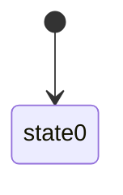

The data in the WiseRatse db seems to be used in CW1 and URS as `Universal` data. E.g. the `Ref_WTG_Commidity` table is used in CW1 to represent '**Universal Commodity Group**' (see [here](https://devops.wisetechglobal.com/wtg/CargoWise/_git/Dev?path=%2FEnterprise%2FProduct%2FOperations%2FRating%2FGUI%2FWiseRates%2FWiseRatesFilterStrip%2FRateFilterStripBusinessObject.cs&version=GBmaster&line=446&lineEnd=448&lineStartColumn=1&lineEndColumn=97&lineStyle=plain&_a=contents "https://devops.wisetechglobal.com/wtg/CargoWise/_git/Dev?path=%2FEnterprise%2FProduct%2FOperations%2FRating%2FGUI%2FWiseRates%2FWiseRatesFilterStrip%2FRateFilterStripBusinessObject.cs&version=GBmaster&line=446&lineEnd=448&lineStartColumn=1&lineEndColumn=97&lineStyle=plain&_a=contents")) and the `Ref_WTG_ServiceLevel` table is used to represent '**Universal Service Level**' (see [here](https://devops.wisetechglobal.com/wtg/CargoWise/_git/Dev?path=%2FEnterprise%2FProduct%2FOperations%2FRating%2FGUI%2FWiseRates%2FWiseRatesFilterStrip%2FRateFilterStripBusinessObject.cs&version=GBmaster&line=711&lineEnd=714&lineStartColumn=1&lineEndColumn=28&lineStyle=plain&_a=contents "https://devops.wisetechglobal.com/wtg/CargoWise/_git/Dev?path=%2FEnterprise%2FProduct%2FOperations%2FRating%2FGUI%2FWiseRates%2FWiseRatesFilterStrip%2FRateFilterStripBusinessObject.cs&version=GBmaster&line=711&lineEnd=714&lineStartColumn=1&lineEndColumn=28&lineStyle=plain&_a=contents")). As such, lets migrate all of the WiseRates tables and add the prefix `Universal` to make this distinction clear, (e.g. `Ref_WTG_ServiceLevel` becomes `RefUniversalServiceLevel` in refdata). This is also reflected in the URS repo:
![[Pasted image 20241211094116.png]]
*UniversalCommodityGroupIntegration* uses `refdata/wiserates/commodities` which in turn uses the `Ref_WTG_Commodity` table.

`Ref_WTG_Container` is redundant and no longer used by RatesService, but, the API that exposes the table does have some uses. As such, we will also migrate `Ref_WTG_Container` as `RefUniversalContainer`. In the future, we may be able to remove this.

see: 
```
https://eye.wtg.ws/s/rating/app/discover#/?_g=(filters:!(),refreshInterval:(pause:!t,value:60000),time:(from:now-4M,to:now))&_a=(columns:!(fields.HttpUserAgent.keyword,fields.AppName,fields.Environment,fields.RequestPath),filters:!(('$state':(store:appState),meta:(alias:!n,disabled:!f,index:f8950458-4205-5c6f-a4a9-0d4de7746ec3,key:fields.AppName,negate:!f,params:(query:RatesService),type:phrase),query:(match_phrase:(fields.AppName:RatesService))),('$state':(store:appState),meta:(alias:!n,disabled:!f,index:f8950458-4205-5c6f-a4a9-0d4de7746ec3,negate:!f,params:!((meta:(alias:!n,disabled:!f,index:f8950458-4205-5c6f-a4a9-0d4de7746ec3,key:fields.RequestPath,negate:!t,params:(query:%2Fapi%2Fv1%2Frates%2Fsearch),type:phrase),query:(match_phrase:(fields.RequestPath:%2Fapi%2Fv1%2Frates%2Fsearch))),(meta:(alias:!n,disabled:!f,field:fields.RequestPath,index:f8950458-4205-5c6f-a4a9-0d4de7746ec3,key:fields.RequestPath,negate:!t,params:(query:%2Fwtg%2Fstatus),type:phrase),query:(match_phrase:(fields.RequestPath:%2Fwtg%2Fstatus))),('$state':(store:appState),meta:(alias:!n,disabled:!f,field:fields.RequestPath,index:f8950458-4205-5c6f-a4a9-0d4de7746ec3,key:fields.RequestPath,negate:!f,params:(query:api%2Fv1%2Frefdata%2Fwiserates%2Fcontainers),type:phrase),query:(match_phrase:(fields.RequestPath:api%2Fv1%2Frefdata%2Fwiserates%2Fcontainers)))),relation:AND,type:combined),query:()),('$state':(store:appState),meta:(alias:!n,disabled:!f,index:f8950458-4205-5c6f-a4a9-0d4de7746ec3,key:fields.MachineName,negate:!f,type:exists,value:exists),query:(exists:(field:fields.MachineName)))),hideAggregatedPreview:!f,index:f8950458-4205-5c6f-a4a9-0d4de7746ec3,interval:auto,query:(language:kuery,query:''),rowHeight:-1,sort:!(!('@timestamp',desc),!(fields.HttpUserAgent.keyword,asc)),viewMode:documents)
```

## Archived thoughts - Ignore Below

_This would solve our problem and enable us to use RefData_, but I have concerns with this as below.

I find that this solution may be confusing since tables `RefContainer` and `RefUniversalContainer` (_which in WiseRates is_ `Ref_WTG_Container`) would represent the same entity, that is, container types. There would also be some duplicated data across these tables such as the `20GP` container.

My understanding is that these two table are different because `Ref_WTG_Container` only requires the container types used by `CargoSphere`/ `CargoGuide`? Because of this `RefContainer` has container types `Ref_WTG_Container` does not have (e.g. `AAA` container type) and `Ref_WTG_Container` has container types `RefContainer` does not have (e.g. `42G2` container type). (see (WI00753743  - RefContainerCodes) and [[WI00753743  - WiseRates RefContainerCodes]])

To me it seems like the original design for this may have been benefited by using CW1 `RefContainer` and migrating CargoGuide/ CargoSphere ref data to the CW1 schema rather than making another table `Ref_WTG_Container` but I'm likely missing some background here. This would be non-trivial now as `RefContainer` has more columns with more details compared to `Ref_WTG_Container` (e.g. weight, capacity, width, height ...).

> [!NOTE]
> I wanted to ask if you knew why it is the case that WiseRates has its own reference tables at all?
> **I believe that having duplicate data in tables as would be required if we were to do my proposed solution would not be ideal, but we have had this quirk (I'm not sure if this is an issue or a design decision I don't understand yet) for a long time.**


- `wiserates/carrierwhitelist` used by UniversalRateService

So far `ChargeCodeMapping` and `CommodityGroups` are unique to Wiserates.


